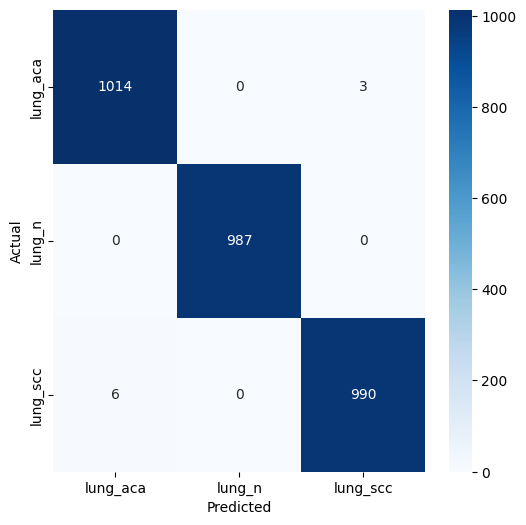

# 🧠 Lung Cancer Detection using Deep Learning (ResNet50)

Deep learning system for **histopathological lung cancer classification** using **transfer learning with ResNet50**.

The model analyzes microscopic lung tissue images and classifies them into three categories:

- **Lung Adenocarcinoma (lung_aca)**
- **Normal Lung Tissue (lung_n)**
- **Lung Squamous Cell Carcinoma (lung_scc)**

This project demonstrates a **complete machine learning pipeline**, including:

- Data preprocessing
- Model training
- Performance evaluation
- Explainability using Grad-CAM
- Deployable inference API

---

# 🚀 Project Highlights

- Transfer learning using **ResNet50 pretrained on ImageNet**
- **99.7% validation accuracy**
- Only **9 misclassifications out of ~3000 validation samples**
- Confusion matrix and detailed performance metrics
- Grad-CAM explainability for medical interpretability
- Deployable **FastAPI inference service**

---

# 📊 Model Performance

### Validation Metrics

| Metric | Score |
|------|------|
Accuracy | **99.7%**
Balanced Accuracy | **99.7%**
Macro F1 Score | **0.997**
Matthews Correlation Coefficient | **0.995**

### Class-wise Performance

| Class | Precision | Recall | F1 Score |
|------|------|------|------|
lung_aca | 0.997 | 0.997 | 0.997
lung_n | 1.000 | 1.000 | 1.000
lung_scc | 0.997 | 0.994 | 0.995

Total errors:

```
9 misclassifications out of ~3000 validation images
```

Error rate:

```
≈ 0.3%
```

---

# 📈 Confusion Matrix



Most classification errors occur between:

```
adenocarcinoma ↔ squamous carcinoma
```

which is expected due to morphological similarity.

---

# 🏗 Model Architecture

Backbone network:

```
ResNet50 (ImageNet pretrained)
```

Input resolution:

```
224 × 224 × 3
```

Classifier head:

```
GlobalAveragePooling2D
BatchNormalization
Dense(128, ReLU)
Dropout(0.4)
Dense(3, Softmax)
```

Training strategy:

- Transfer learning
- Frozen convolutional base
- Custom classification layers

---

# 🧪 Training Setup

Optimizer

```
Adam (learning rate = 1e-4)
```

Loss Function

```
Sparse Categorical Crossentropy
```

Regularization techniques used:

- Data augmentation
- Dropout
- Batch normalization
- Early stopping
- Learning rate scheduling

---

# 📂 Project Structure

```
lung-cancer-detection/
│
├── data/
│
├── notebooks/
│   └── lung_training.ipynb
│
├── src/
│   ├── dataset.py
│   ├── model.py
│   ├── train.py
│   ├── evaluate.py
│   └── gradcam.py
│
├── api/
│   └── main.py
│
├── outputs/
│   ├── models/
│   │   └── lung_model.keras
│   └── plots/
│       ├── confusion_matrix.png
│       ├── roc_curve.png
│       └── pr_curve.png
│
├── requirements.txt
└── README.md
```

---

# 🧬 Dataset

Dataset used:

**Lung and Colon Cancer Histopathological Images**

Source:

https://www.kaggle.com/datasets/andrewmvd/lung-and-colon-cancer-histopathological-images

For this project only the **lung histopathology dataset** is used.

Classes:

| Class | Description |
|------|-------------|
lung_aca | Lung Adenocarcinoma
lung_n | Normal Lung Tissue
lung_scc | Lung Squamous Cell Carcinoma

---

# 🧠 Explainability with Grad-CAM

Grad-CAM is implemented to visualize **which regions of the histopathology images influence the model's predictions**.

Workflow:

```
Input Image
   ↓
Forward Pass
   ↓
Gradient Computation
   ↓
Heatmap Generation
   ↓
Overlay on Original Image
```

This helps verify that the model focuses on **relevant tumor regions** rather than irrelevant textures.

---

# ⚡ Running the Project

## Clone the repository

```bash
git clone https://github.com/faizdevx/lung-cancer-detection.git
cd lung-cancer-detection
```

---

## Install dependencies

```bash
pip install -r requirements.txt
```

---

## Train the model

```bash
python src/train.py
```

---

## Evaluate the model

```bash
python src/evaluate.py
```

---

# 🌐 Run the Inference API

Start FastAPI server:

```bash
uvicorn api.main:app --reload
```

Open API documentation:

```
http://127.0.0.1:8000/docs
```

Upload an image and receive a prediction.

Example response:

```
{
  "prediction": "adenocarcinoma",
  "confidence": 0.997
}
```

---

# 🔮 Future Improvements

Potential improvements for this system:

- Fine-tuning deeper ResNet layers
- Cross-slide validation to prevent data leakage
- Multi-scale tissue patch analysis
- Larger histopathology datasets
- Clinical evaluation studies

---

# 🛠 Tech Stack

- Python
- TensorFlow / Keras
- NumPy
- Scikit-learn
- Matplotlib
- Seaborn
- FastAPI

---

# 👨‍💻 Author

Faizal  

