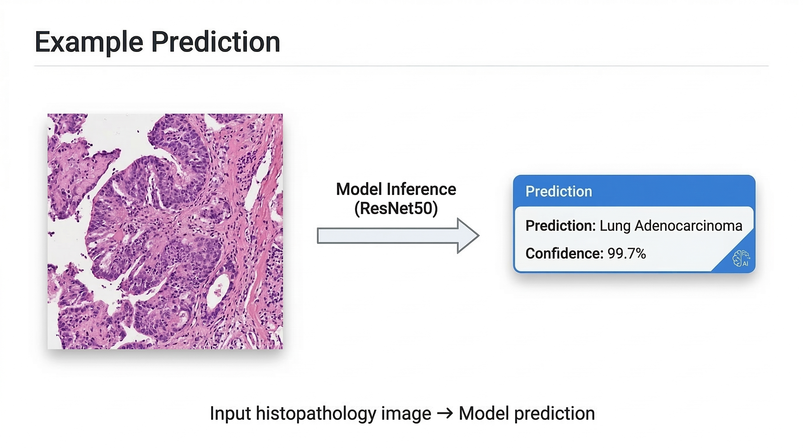
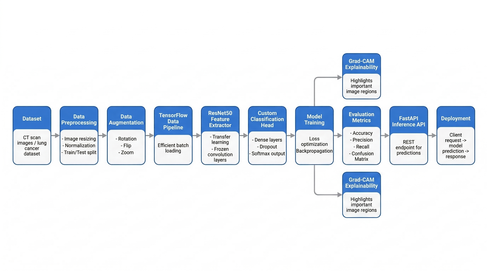
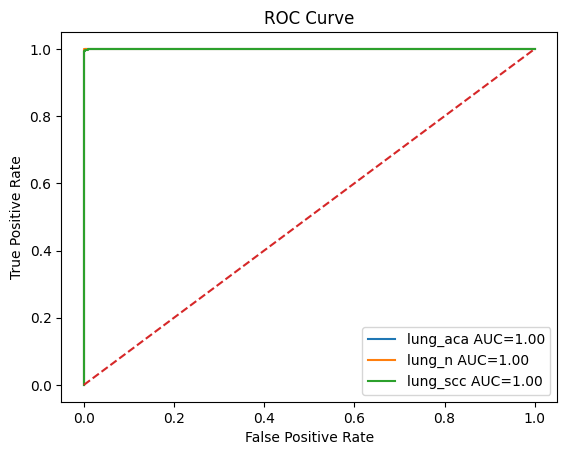

# Lung Cancer Detection using Deep Learning (ResNet50)



Deep learning system for **histopathological lung cancer classification** using **transfer learning with ResNet50**.

The model analyzes microscopic lung tissue images and classifies them into three categories.

---

## Features

- Transfer learning using **ResNet50 pretrained on ImageNet**
- Classification of lung histopathology images into three tissue classes
- Grad-CAM visualization for model explainability
- Training and evaluation pipeline
- Deployable **FastAPI inference service**

---

## Pipeline



---

## Model Overview

**Backbone**

ResNet50 (ImageNet pretrained)

**Input**

224 × 224 × 3

**Classifier Head**

```
GlobalAveragePooling2D
BatchNormalization
Dense(128, ReLU)
Dropout(0.4)
Dense(3, Softmax)
```

---

## Model Performance

### Validation Metrics

| Metric | Score |
|------|------|
| Accuracy | 99.7% |
| Balanced Accuracy | 99.7% |
| Macro F1 Score | 0.997 |
| Matthews Correlation Coefficient | 0.995 |

### Class-wise Performance

| Class | Precision | Recall | F1 Score |
|------|------|------|------|
| lung_aca | 0.997 | 0.997 | 0.997 |
| lung_n | 1.000 | 1.000 | 1.000 |
| lung_scc | 0.997 | 0.994 | 0.995 |

Total errors

```
9 misclassifications out of ~3000 validation images
```

---

## Confusion Matrix


Most classification errors occur between

```
adenocarcinoma ↔ squamous carcinoma
```

due to morphological similarity.

---

## ROC Curve



---

## Dataset

Dataset used:

**Lung and Colon Cancer Histopathological Images**

Source  
https://www.kaggle.com/datasets/andrewmvd/lung-and-colon-cancer-histopathological-images

Classes

| Class | Description |
|------|-------------|
| lung_aca | Lung Adenocarcinoma |
| lung_n | Normal Lung Tissue |
| lung_scc | Lung Squamous Cell Carcinoma |

---

## Project Structure

```
lung-cancer-detection
│
├── data
│
├── notebooks
│   └── lung_training.ipynb
│
├── src
│   ├── dataset.py
│   ├── model.py
│   ├── train.py
│   ├── evaluate.py
│   └── gradcam.py
│
├── api
│   └── main.py
│
├── outputs
│   ├── models
│   │   └── lung_model.keras
│   └── plots
│       ├── confusion_matrix.png
│       ├── roc_curve.png
│       └── pr_curve.png
│
├── requirements.txt
└── README.md
```

---

## Installation

Clone repository

```bash
git clone https://github.com/faizdevx/lung-cancer-detection.git
cd lung-cancer-detection
```

Install dependencies

```bash
pip install -r requirements.txt
```

---

## Train the Model

```bash
python src/train.py
```

---

## Evaluate the Model

```bash
python src/evaluate.py
```

---

## Run the Inference API

Start FastAPI server

```bash
uvicorn api.main:app --reload
```

Open API documentation

```
http://127.0.0.1:8000/docs
```

Example response

```json
{
  "prediction": "adenocarcinoma",
  "confidence": 0.997
}
```

---

## Explainability

Grad-CAM is implemented to visualize regions of histopathology images that influence model predictions.

Workflow

```
Input Image
   ↓
Forward Pass
   ↓
Gradient Computation
   ↓
Heatmap Generation
   ↓
Overlay on Original Image
```

---

## Tech Stack

- Python  
- TensorFlow / Keras  
- NumPy  
- Scikit-learn  
- Matplotlib  
- FastAPI  

---

## Author

Faizal
